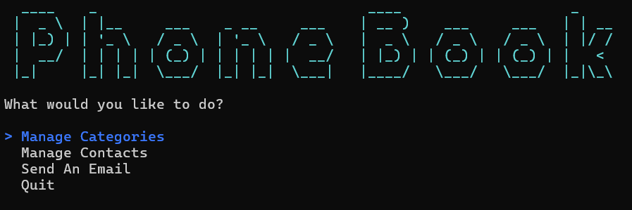
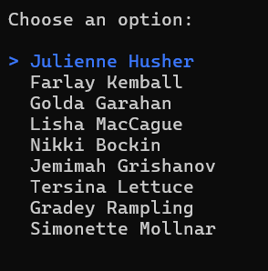
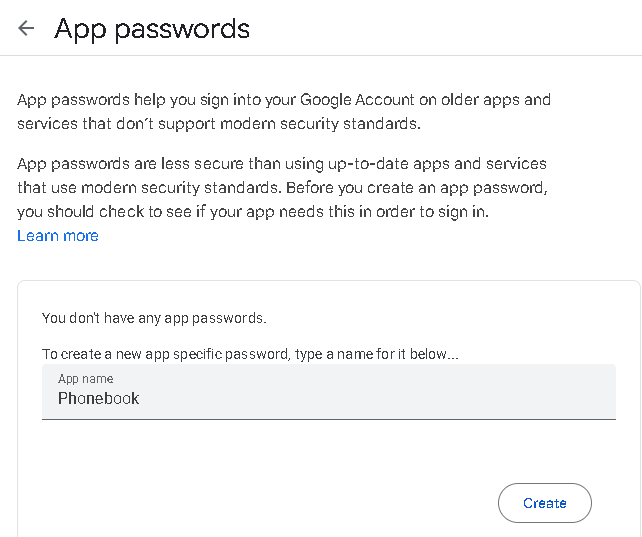
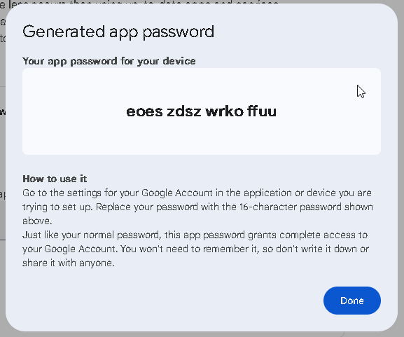
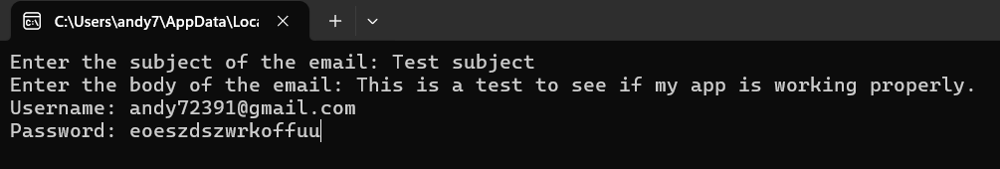

# Phonebook Console App



A simple .NET console application for adding and managing contacts. Contacts are categorized as family, work or friends.
You can also add new categories and contacts, edit existing ones or delete them.

This app offers the ability to choose a contact from your list and send an email to them. You must have a Gmail account to use it. It also requires the use of "App Passwords" so as to not store any passwords in this project, for security reasons.



## Features

- Add new contacts and categories
- View contacts and categories
- Edit or delete contacts and categories
- Send email to any of your contacts

## Getting Started

<mark>Important note! You must have a database in SQL Server named "phonebook" in (LocalDB)\MSSQLLocalDB to use this app</mark>

1. Clone the repository:

   ```bash
   git clone https://github.com/andymartinez1/Console-Phone-Book-App.git
   ```

2. Navigate to the project directory:

   ```bash
   cd Phone-Book
   ```

3. Build and run the app:

   ```bash
   dotnet run
   ```

4. To use the email function, select "Send An Email" from the main menu and choose the contact you would like to email
5. Enter the subject of the email, then the body
6. It will then ask for a username. This is your Gmail account
7. For password, you must have 2FA enabled on your Gmail account. Then in the security settings, you can generate an app
   password:





8. The generated app password is what must be entered:



## Technologies Used

- C#
- Entity Framework
- SQL
- Spectre Console
